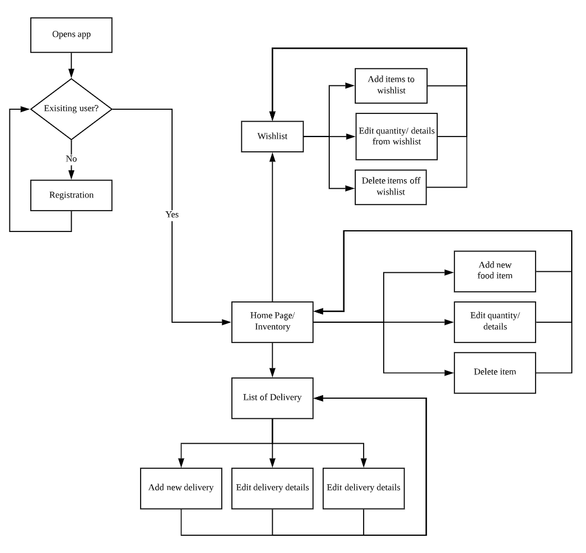
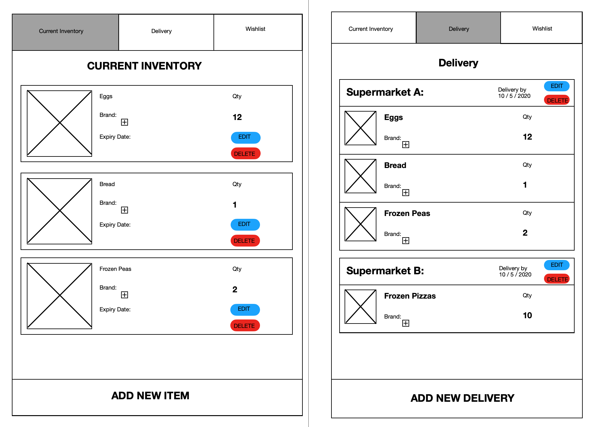

# hungry-go-nowhere

## Background
Getting prepared for COVID circuit breaker comes down to one basic thing - <strong>Food</strong>. 
Or toilet paper evidently, but really that only becomes a concern once you have had some food, if you think about it.
(Okay, maybe don't think about it.)

We gotta eat. And more often than not, we are going to need to know what's in our kitchens to prepare these meals.

## Problem
It is difficult to keep track of what food items are currently in our kitchen (inventory), and what groceries are being delivered to us from various supermarkets, at what time.

## Solution
An app to keep track of current food inventory, arriving food items as well as delivery time.

## User Stories
1. As a stay-home meal preparer, I want to create a list of food items in my inventory so I know what ingredients I have available to prepare my meals.

2. As a stay-home meal preparer, I want to be able to update the quantity of the food items in my current inventory after consumption or purchase, so I can keep my inventory up-to-date.

3. As a stay-home meal preparer, I want to be able to see a list of food items which are being delivered to me from various supermarkets, as well as when they are arriving, so I know the availability of food items to plan my meals.

4. As a stay-home meal preparer, I want to keep track of the expiry dates of my food items so that I can use them before they expire.

5. As a stay-home meal preparer, I want to create a wishlist of food items that I would need to buy, so that I can make my online orders quickly when delivery slots (which are limited) becomes available.

## User Flow

## Wireframing

## ERD
